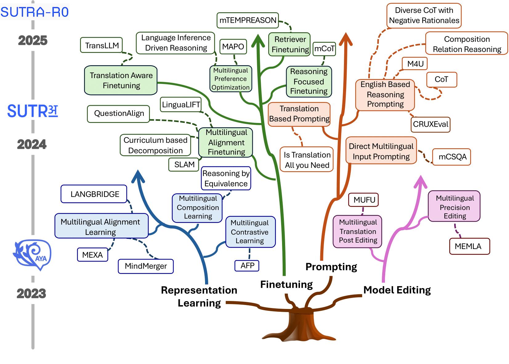
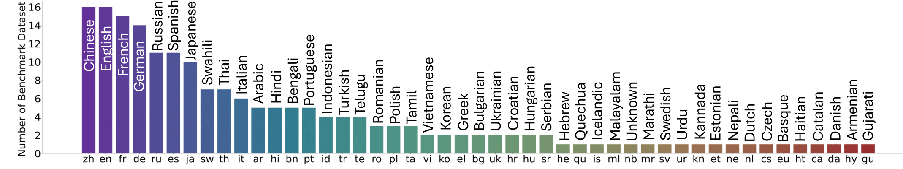
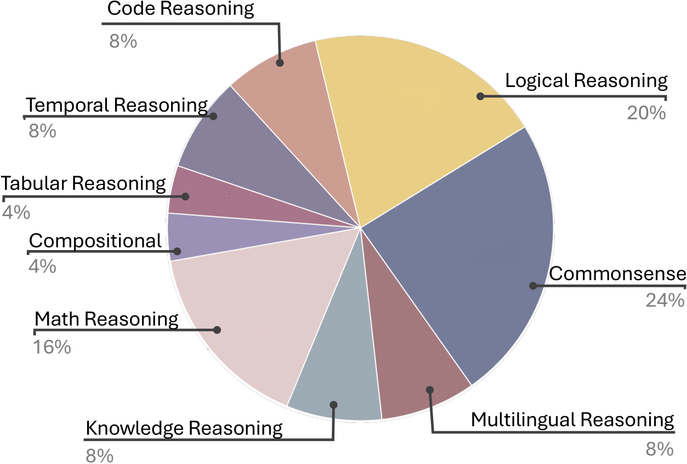
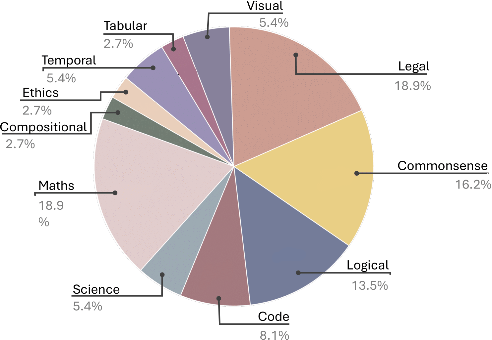

#  Survey of Multilingual Reasoning in Language Models

[](https://arxiv.org/abs/2502.09457)

### Accepted in EMNLP 2025

<p align="center">
    
</p>

#### [Akash Ghosh](https://scholar.google.com/citations?user=NWc6Pw8AAAAJ&hl=en), [Debayan Datta](https://github.com/debayan-datta), [Sriparna Saha](https://scholar.google.com/citations?hl=en&user=Fj7jA_AAAAAJ), [Chirag Agarwal](https://scholar.google.com/citations?hl=en&user=AFEjd1QAAAAJ) 

---

<p align="center">
  
</p>

---

## About the Paper
**“Survey of Multilingual Reasoning in Language Models”**, provides the first in-depth review of multilingual reasoning in LMs. 
- systematic overview of existing methods that leverage LMs for multilingual reasoning, specifically outlining the challenges, motivations, and foundational aspects of applying language models to reason across diverse languages. 

- Overview of the standard data resources used for training multilingual reasoning in LMs and the evaluation benchmarks employed to assess their multilingual capabilities. 

- analyze various state-of-the-art methods and their performance on these benchmarks. 
- Explore future research opportunities to improve multilingual reasoning in LMs, focusing on enhancing their ability to handle diverse languages and complex reasoning tasks.


<p align="center">
  
<!--    -->
</p>


<div style="display: flex; justify-content: center; align-items: center;">
  
  
</div>

---

## Content of the Repository
This repository complements our survey paper, **“Survey of Multilingual Reasoning in Language Models”**. We identify four primary thrusts, viz. **Representation Alignment**, **Fine-tuning**, **Prompting**, and **Model Editing**, that collectively contribute to advancing multilingual reasoning in language models.


# 📖 Papers  


## Representation Learning
* Improving In-context Learning of Multilingual Generative Language Models with Cross-lingual Alignment [[Paper]](https://aclanthology.org/2024.naacl-long.445/)
* MindMerger: Efficient Boosting LLM Reasoning in non-English Languages [[Paper]](https://arxiv.org/abs/2405.17386)
* LangBridge: Multilingual Reasoning Without Multilingual Supervision
 [[Paper]](https://arxiv.org/abs/2401.10695)


## Fine-tuning
* LinguaLIFT: An Effective Two-stage Instruction Tuning Framework for Low-Resource Language Reasoning [[Paper]](https://arxiv.org/abs/2412.12499)
* Understand, Solve and Translate: Bridging the Multilingual Mathematical Reasoning Gap [[Paper]](https://arxiv.org/abs/2501.02448v2)
* SLAM: Towards Efficient Multilingual Reasoning via Selective Language Alignment [[Paper]](https://arxiv.org/abs/2501.03681)
* Why Not Transform Chat Large Language Models to Non-English? [[Paper]](https://arxiv.org/abs/2405.13923)

## Prompting
* mCSQA: Multilingual Commonsense Reasoning Dataset with Unified Creation Strategy by Language Models and Humans [[Paper]](https://arxiv.org/abs/2406.04215v1)
* Is Translation All You Need? A Study on Solving Multilingual Tasks with Large Language Models [[Paper]](https://arxiv.org/abs/2403.10258)
* Exploring the Limitations of Large Language Models in Compositional Relation Reasoning [[Paper]](https://arxiv.org/abs/2403.02615)

## Model Editing
* MEMLA: Enhancing Multilingual Knowledge Editing with Neuron-Masked Low-Rank Adaptation [[Paper]](https://arxiv.org/abs/2406.11566)
* Mufu: Multilingual Fused Learning for Low-Resource Translation with LLM [[Paper]](https://arxiv.org/abs/2409.13949)
* Crosslingual Reasoning through Test-Time Scaling [[Paper]](https://arxiv.org/abs/2505.05408)

---


## Citation

If you find our work useful or use it in your research, please consider citing:

```bibtex
@article{ghosh2025multilingual,
  title={The multilingual mind: A survey of multilingual reasoning in language models},
  author={Ghosh, Akash and Datta, Debayan and Saha, Sriparna and Agarwal, Chirag},
  journal={arXiv preprint arXiv:2502.09457},
  year={2025}
}
```


